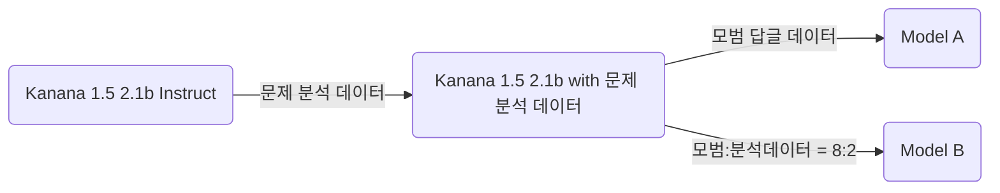

# 심장, 마음의 운동장

초등학생시절, 선생님의 따듯한 관심과 애정의 추억을 불러오는 일기장. 심장

## 주요 기능

**따듯한 관심과 애정이 담긴 답글 작성**

일기에 나타나는 감정을 알아차려주고, 이해하고, 생각의 방향을 잡아주는 답글을 작성합니다.

**온디바이스 언어 모델**

합성데이터로 파인튜닝된 소형 언어 모델을 기기 내부에서 담아 사용자의 일기를 서버로 전송하지 않고 답글을 작성합니다.

**감정 달력**

달력에 그 날의 감정을 붙여 한 달 동안 감정의 추이를 확인할 수 있습니다.

## 주요 문제 해결

- https://github.com/seheon99/simjang-diary/pull/6#issue-5072363912

## 기술 스택

| 분야 | 기술                              |
| ---- | --------------------------------- |
| 모델 | Kanana 1.5 2.1B + LoRA + Q4 + MLX |
| 앱   | SwiftUI + MLX Swift LM            |

### Kanana 1.5 vs Qwen 2.5 vs SmolLM 2

**벤치마크 점수 측정**

| 모델       | 크기   | KMMLU  | KoBEST | KoBEST:감정분류 | HAERAE |
| ---------- | ------ | ------ | ------ | --------------- | ------ |
| RANDOM     |        | 25%    | 47.26% | 50%             | 20%    |
| GPT-4      |        | 59.95% | 81.12% | -               | 67.85% |
| Kanana 1.5 | 2.086B | 39.83% | 64.61% | 87.66%          | 73.14% |
| Qwen 2.5   | 3.085B | 43.58% | 61.02% | 53.65%          | 53.35% |
| SmolLM 2   | 1.711B | 26.68% | 48.24% | 53.15%          | 23.65% |

Kanana 1.5는 Qwen 2.5에 비해 적은 파라미터 수로 감정분류와 한국 지식, 문화적 맥락을 평가하는 HAERAE에서 높은 점수를 보이고, 특히 HAERAE에서는 GPT-4 보다 높은 점수를 기록했습니다.

**일기 답글 작성 능력**

|                | Kanana 1.5 | Qwen 2.5 | Gemma 3 |
| -------------- | ---------- | -------- | ------- |
| 감정 파악 능력 | **99%**    | 95%      | 90%     |
| 지시 이행 능력 | **98%**    | 72%      | 34%     |
| 답변 품질      | **6%**     | 0        | 0       |

또한 각 모델에게 같은 프롬프트로 선생님 역할을 지정한 뒤 일기 커멘트를 작성시켰습니다. 다음 세 가지 기준으로 LLM을 통해 평가했습니다.

- **감정 파악 능력 (Pass/Fail)**: 감정을 올바르게 파악했는가
- **지시 이행 능력 (Pass/Fail)**: 감정에 따라 적절한 문장 수로 답하고, 마크다운, 이모지 등 특수 문자 없이 말투가 일정한가
- **답변 품질 (각 지표별 Pass/Fail)**: 사용자의 감정을 인지하고, 명명하고, 이해하고, 완곡화하고, 정상화하고, 마무리 했는가

**결론**

**kanana-1.5-2.1b-instruct** 모델이 일기 속에서 감정을 이해하고 한국의 문화적 맥락을 가장 잘 파악했습니다. 하지만 동시에 절대적인 답변 품질이 기대에 미치지 못했습니다. 따라서 모델은 Kanana 1.5 로 고정하고, 일기 답글 작성 능력을 파인튜닝했습니다.

### 파인튜닝

[Kanana 모델 개발 논문](https://ar5iv.labs.arxiv.org/html/2502.18934v3)에서 두 단계로 나누어 학습한 방법을 차용했습니다. 합성 일기에서 기존 일기 답글의 문제점을 분석한 데이터, 모범 답변 데이터를 생성했습니다. 이후, 모델을 학습시킬 때 문제점을 분석한 데이터를 먼저 학습시킨 후, 다음 단계에서 모범 답안 데이터를 학습시켰습니다.

Model A는 모범 답글 데이터로만 2차 학습을 했고, Model B는 분석 데이터를 잊지 않게 하기 위해 20% 섞어서 2차 학습했습니다.

| 모델    | 감정 파악 능력 | 지시 이행 능력 |  답변 품질 |
| ------- | -------------: | -------------: | ---------: |
| Model A |     **82/100** |         84/100 | **69/100** |
| Model B |         71/100 |     **91/100** |     64/100 |

결과는 예상했던 것과 모든 지표에서 반대로 나타났는데, Model A가 Model B보다 감정을 잘 파악하고, 지시를 덜 따르며, 답변 품질이 좋게 나왔습니다.

### Kanana 1.5 vs Kanana 2

[Kanana 2의 공개된 구현](https://huggingface.co/kakaocorp/kanana-2-1.3b-instruct/blob/main/modeling_kanana2_tiny.py)을 MLX-Swift-LM 으로 변환했습니다.

- https://github.com/seheon99/mlx-swift-lm/blob/main/Libraries/MLXLLM/Models/Kanana2Tiny.swift

하지만, [KANANA OPEN LICENSE AGREEMENT](https://huggingface.co/kakaocorp/kanana-2-1.3b-instruct/blob/main/LICENSE) 로 인해 서비스에 탑재하지 못했고, Kanana 1.5를 사용했습니다.
