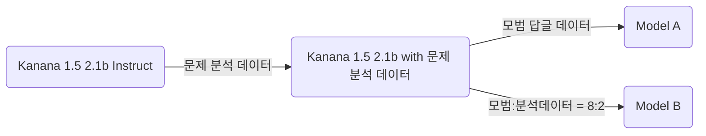

<a href="https://apps.apple.com/kr/app/%EC%8B%AC%EC%9E%A5-%EB%A7%88%EC%9D%8C%EC%9D%98-%EC%9A%B4%EB%8F%99%EC%9E%A5/id6797366569?itscg=30200&itsct=apps_box_artwork&mttnsubad=6797366569" style="position: relative; width: 170px; height: 170px; overflow: hidden; display: inline-block; vertical-align: middle; margin-left: 50%; transform: translateX(-50%);
--app-icon-mask: url('data:image/svg+xml,%0A%3Csvg%20xmlns%3D%22http%3A%2F%2Fwww.w3.org%2F2000%2Fsvg%22%20xml%3Aspace%3D%22preserve%22%20viewBox%3D%220%200%20230.5%20230.5%22%3E%0A%20%20%3Cpath%20fill-rule%3D%22evenodd%22%20stroke-linejoin%3D%22round%22%20stroke-miterlimit%3D%221.4%22%20clip-rule%3D%22evenodd%22%20d%3D%22M158.2%20230H64.1a320%20320%200%200%201-7-.1c-5%200-10-.5-15-1.3a50.8%2050.8%200%200%201-14.4-4.8%2048.2%2048.2%200%200%201-21-21%2050.9%2050.9%200%200%201-4.8-14.4%20100.7%20100.7%200%200%201-1.3-15v-7l-.1-8.2V64.1a320%20320%200%200%201%20.1-7c0-5%20.5-10%201.3-15a50.7%2050.7%200%200%201%204.8-14.4%2048.2%2048.2%200%200%201%2021-21%2051%2051%200%200%201%2014.4-4.8c5-.8%2010-1.2%2015-1.3a320%20320%200%200%201%207%200l8.2-.1h94.1a320%20320%200%200%201%207%20.1c5%200%2010%20.5%2015%201.3a52%2052%200%200%201%2014.4%204.8%2048.2%2048.2%200%200%201%2021%2021%2050.9%2050.9%200%200%201%204.8%2014.4c.8%205%201.2%2010%201.3%2015a320%20320%200%200%201%20.1%207v102.3l-.1%207c0%205-.5%2010-1.3%2015a50.7%2050.7%200%200%201-4.8%2014.4%2048.2%2048.2%200%200%201-21%2021%2050.8%2050.8%200%200%201-14.4%204.8c-5%20.8-10%201.2-15%201.3a320%20320%200%200%201-7%200l-8.2.1z%22%2F%3E%0A%3C%2Fsvg%3E%0A');">

<svg xmlns="http://www.w3.org/2000/svg" viewBox="0 0 230.5 230.5" style="position: absolute; top: 0; left: 0; width: 100%; height: 100%; pointer-events: none; box-sizing: border-box;">
<path fill="none" stroke="#000" stroke-linejoin="round" stroke-miterlimit="1.4" stroke-opacity=".1" stroke-width="1" d="M158.2 230H64.1a320 320 0 0 1-7-.1c-5 0-10-.5-15-1.3a50.8 50.8 0 0 1-14.4-4.8 48.2 48.2 0 0 1-21-21 50.9 50.9 0 0 1-4.8-14.4 100.7 100.7 0 0 1-1.3-15v-7l-.1-8.2V64.1a320 320 0 0 1 .1-7c0-5 .5-10 1.3-15a50.7 50.7 0 0 1 4.8-14.4 48.2 48.2 0 0 1 21-21 51 51 0 0 1 14.4-4.8c5-.8 10-1.2 15-1.3a320 320 0 0 1 7 0l8.2-.1h94.1a320 320 0 0 1 7 .1c5 0 10 .5 15 1.3a52 52 0 0 1 14.4 4.8 48.2 48.2 0 0 1 21 21 50.9 50.9 0 0 1 4.8 14.4c.8 5 1.2 10 1.3 15a320 320 0 0 1 .1 7v102.3l-.1 7c0 5-.5 10-1.3 15a50.7 50.7 0 0 1-4.8 14.4 48.2 48.2 0 0 1-21 21 50.8 50.8 0 0 1-14.4 4.8c-5 .8-10 1.2-15 1.3a320 320 0 0 1-7 0l-8.2.1z" clip-rule="evenodd" vector-effect="non-scaling-stroke"/>
</svg>
</a>

<a href="https://apps.apple.com/kr/app/%EC%8B%AC%EC%9E%A5-%EB%A7%88%EC%9D%8C%EC%9D%98-%EC%9A%B4%EB%8F%99%EC%9E%A5/id6797366569?itscg=30200&itsct=apps_box_badge&mttnsubad=6797366569" style="display: inline-block; margin-left: 50%; transform: translateX(-50%);">
<picture>
  <source media="(prefers-color-scheme: dark)" srcset="https://toolbox.marketingtools.apple.com/api/v2/badges/download-on-the-app-store/black/en-us?releaseDate=1785974400">
  <source media="(prefers-color-scheme: light)" srcset="https://toolbox.marketingtools.apple.com/api/v2/badges/download-on-the-app-store/white/en-us?releaseDate=1785974400">
  
</picture>
</a>

# 심장, 마음의 운동장

선생님의 따듯한 관심과 애정의 추억을 불러오는 일기장. 심장

## 주요 기능

**따듯한 관심과 애정이 담긴 답글 작성**

일기에 나타나는 감정을 알아차려주고, 이해하고, 생각의 방향을 잡아주는 답글을 작성합니다.

**온디바이스 언어 모델**

합성데이터로 파인튜닝된 소형 언어 모델을 기기 내부에서 담아 사용자의 일기를 서버로 전송하지 않고 답글을 작성합니다.

**감정 달력**

달력에 그 날의 감정을 붙여 한 달 동안 감정의 추이를 확인할 수 있습니다.

## 주요 문제 해결

- MLX 캐시 메모리 관리: https://github.com/seheon99/simjang-diary/pull/6

## Open Source Contributions

- LlamaConfig 파싱 후 유효성 체크 중 올바른 값을 에러로 표시하는 문제 해결: https://github.com/huggingface/transformers/pull/47707

## 기술 스택

| 분야 | 기술                              |
| ---- | --------------------------------- |
| 모델 | Kanana 1.5 2.1B + LoRA + Q4 + MLX |
| 앱   | SwiftUI + MLX Swift LM            |

### Kanana 1.5 vs Qwen 2.5 vs SmolLM 2

**벤치마크 점수 측정**

| 모델       | 크기   | KMMLU  | KoBEST | KoBEST:감정분류 | HAERAE |
| ---------- | ------ | ------ | ------ | --------------- | ------ |
| RANDOM     |        | 25%    | 47.26% | 50%             | 20%    |
| GPT-4      |        | 59.95% | 81.12% | -               | 67.85% |
| Kanana 1.5 | 2.086B | 39.83% | 64.61% | 87.66%          | 73.14% |
| Qwen 2.5   | 3.085B | 43.58% | 61.02% | 53.65%          | 53.35% |
| SmolLM 2   | 1.711B | 26.68% | 48.24% | 53.15%          | 23.65% |

Kanana 1.5는 Qwen 2.5에 비해 적은 파라미터 수로 감정분류와 한국 지식, 문화적 맥락을 평가하는 HAERAE에서 높은 점수를 보이고, 특히 HAERAE에서는 GPT-4 보다 높은 점수를 기록했습니다.

**일기 답글 작성 능력**

|                | Kanana 1.5 | Qwen 2.5 | Gemma 3 |
| -------------- | ---------- | -------- | ------- |
| 감정 파악 능력 | **99%**    | 95%      | 90%     |
| 지시 이행 능력 | **98%**    | 72%      | 34%     |
| 답변 품질      | **6%**     | 0        | 0       |

또한 각 모델에게 같은 프롬프트로 선생님 역할을 지정한 뒤 일기 커멘트를 작성시켰습니다. 다음 세 가지 기준으로 LLM을 통해 평가했습니다.

- **감정 파악 능력 (Pass/Fail)**: 감정을 올바르게 파악했는가
- **지시 이행 능력 (Pass/Fail)**: 감정에 따라 적절한 문장 수로 답하고, 마크다운, 이모지 등 특수 문자 없이 말투가 일정한가
- **답변 품질 (각 지표별 Pass/Fail)**: 사용자의 감정을 인지하고, 명명하고, 이해하고, 완곡화하고, 정상화하고, 마무리 했는가

**결론**

**kanana-1.5-2.1b-instruct** 모델이 일기 속에서 감정을 이해하고 한국의 문화적 맥락을 가장 잘 파악했습니다. 하지만 동시에 절대적인 답변 품질이 기대에 미치지 못했습니다. 따라서 모델은 Kanana 1.5 로 고정하고, 일기 답글 작성 능력을 파인튜닝했습니다.

### 파인튜닝

[Kanana 모델 개발 논문](https://ar5iv.labs.arxiv.org/html/2502.18934v3)에서 두 단계로 나누어 학습한 방법을 차용했습니다. 합성 일기에서 기존 일기 답글의 문제점을 분석한 데이터, 모범 답변 데이터를 생성했습니다. 이후, 모델을 학습시킬 때 문제점을 분석한 데이터를 먼저 학습시킨 후, 다음 단계에서 모범 답안 데이터를 학습시켰습니다.

Model A는 모범 답글 데이터로만 2차 학습을 했고, Model B는 분석 데이터를 잊지 않게 하기 위해 20% 섞어서 2차 학습했습니다.

| 모델    | 감정 파악 능력 | 지시 이행 능력 |  답변 품질 |
| ------- | -------------: | -------------: | ---------: |
| Model A |     **82/100** |         84/100 | **69/100** |
| Model B |         71/100 |     **91/100** |     64/100 |

결과는 예상했던 것과 모든 지표에서 반대로 나타났는데, Model A가 Model B보다 감정을 잘 파악하고, 지시를 덜 따르며, 답변 품질이 좋게 나왔습니다.

### Kanana 1.5 vs Kanana 2

[Kanana 2의 공개된 구현](https://huggingface.co/kakaocorp/kanana-2-1.3b-instruct/blob/main/modeling_kanana2_tiny.py)을 MLX-Swift-LM 으로 변환했습니다.

- https://github.com/seheon99/mlx-swift-lm/blob/main/Libraries/MLXLLM/Models/Kanana2Tiny.swift

하지만, [KANANA OPEN LICENSE AGREEMENT](https://huggingface.co/kakaocorp/kanana-2-1.3b-instruct/blob/main/LICENSE) 로 인해 서비스에 탑재하지 못했고, Kanana 1.5를 사용했습니다.
