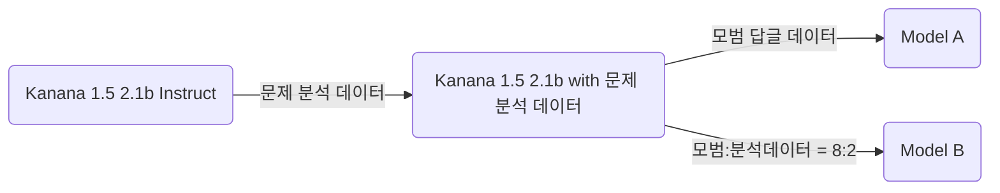

  

<h1 align="center">심장</h1>

  <strong>마음의 운동장</strong> 
  선생님의 따듯한 관심과 애정이 담긴 한 줄의 추억을 불러오는 일기장. 심장

  <a href="#주요-기능"><strong>주요 기능</strong></a> .
  <a href="#문제-해결"><strong>문제 해결</strong></a> .
  <a href="#기술-스택"><strong>기술 스택</strong></a>

  

---

## 주요 기능

**따듯한 관심과 애정이 담긴 답글 작성**

일기에 나타나는 감정을 알아차려주고, 이해하고, 생각의 방향을 잡아주는 답글을 작성합니다.

**감정 달력**

달력에 그 날의 감정을 붙여 한 달 동안 감정의 추이를 확인할 수 있습니다.

**온디바이스 언어 모델**

파인튜닝된 소형 언어 모델을 기기 내부에서 담아 사용자의 일기를 서버로 전송하지 않고 답글을 작성합니다.

## 문제 해결

- MLX 캐시 메모리 관리: https://github.com/seheon99/simjang-diary/pull/6

## 파인튜닝

[Kanana 모델 개발 논문](https://ar5iv.labs.arxiv.org/html/2502.18934v3)에서 두 단계로 나누어 학습한 방법을 차용했습니다.
Kanana 답글의 문제점을 분석한 데이터와 모범 답변 데이터를 생성하고, 모델을 학습시킬 때 문제점을 분석한 데이터를 먼저 학습시킨 후, 다음 단계에서 모범 답안 데이터를 학습시켰습니다.

Model A는 모범 답글 데이터로만 2차 학습을 했고, Model B는 분석 데이터를 잊지 않게 하기 위해 20% 섞어서 2차 학습했습니다.
학습 결과는 예상했던 것과 다르게 나타났는데, 감정 파악 능력과 전체 답변 품질이 Model A에서 높게 나와 A를 최종 모델로 사용했습니다.

| 모델    | 감정 파악 능력 | 지시 이행 능력 |  답변 품질 |
| ------- | -------------: | -------------: | ---------: |
| Model A |     **82/100** |         84/100 | **69/100** |
| Model B |         71/100 |     **91/100** |     64/100 |
